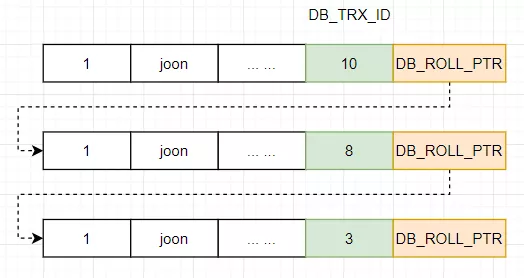

## ***简历***

- 自我介绍
  - 面试官您好，我叫刘炎。目前重庆大学汽车协同创新中心专硕在读，实验室主要工作是做监测系统软件开发，有做过两个关于故障诊断的系统，一个是关于旋转机械，还有一个是关于噪声信号的。两个系统的可用性和准确性都接近于NI公司的软件水平。平时都是在自学java相关的一些东西，做了两个小项目，第一个是一个小程序的项目，主要是用来记录我和女朋友两人日常生活的一个小程序。两人可以自己编辑日记并上传，前端采用的是小程序，后端使用的SSM框架实现的，小程序主要包括时间纪念日模块，日记时间轴展示模块。展示模块添加了分页处理，来提高程序的响应速度。还有一个项目是一个简单的秒杀系统，模拟商城秒杀场景，来应对一些高并发场景，使用了Redis来提前缓存秒杀商品，来减轻数据库的压力，同时使用了redis 分布式锁SetNx + expire，保障了事务在同一时刻只有一个线程来执行，同时还使用了消息中间件RabbitMQ对列异步进行下单，达到削峰，减轻数据库的压力。


- 小程序

  - 图片上传流程

    - 使用`wx.uploadFile()`接口，将本地资源上传到指定服务器。参数有`url, filepath, filename`等。`url`为后台的上传图片接口。图片是以`content-type`为`multipart/form-data`格式上传，使用`MVC`通过参数的形式以二进制的格式获取。
    - 日记存储，将富文本数据转换为`html`格式，直接将`html`内容存储到数据库中。字段选择`longtext`类型。
    - 读取和解析 `HtmlUtils`

  - 分页查询实现

    - `select * from table limit param1,param2` 1为查询开始，2为查询条目数，页大小

    

  - 本地缓存

    - `wx.setStorage()`

- 秒杀系统

  - `spring Boot`
  - `mybatis`
  - `Redis`---基于内存的高性能key-value数据库。
    - 常见数据类型：string，list，set，sorted set，hash
    - 分布式锁
      - 使用`SETNX`+`EXPIRE`实现 但是会产生死锁
      - 考虑使用基于`redisson`的分布式锁--类似于`ReentrantLock`（防止死锁出现）
  - 页面缓存
  - 消息中间件`RabbitMQ`
    - `ConnectionFactory`（连接管理器）：应用程序与Rabbit之间建立连接的管理器，程序代码中使用。
    - `Channel`（信道）：消息推送使用的通道。
    - `Exchange`（交换器）：用于接受、分配消息。
    - `Queue`（队列）：用于存储生产者的消息。
    - `RoutingKey`（路由键）：用于把生成者的数据分配到交换器上。
    - `BindingKey`（绑定键）：用于把交换器的消息绑定到队列上。
    - 流量削峰
    - 
  - 图形验证码，接口地址隐藏，限流防刷。
    - 腾讯验证码
    - 接口地址隐藏---秒杀前，请求一个生成秒杀地址的接口，返回一个随机数存入缓存，前端拼接得到真正的秒杀地址，后端接收到参数后，与缓存中的地址做验证。
    - 限流-令牌桶算法的原理是系统会以一个恒定的速度往桶里放入令牌，而如果请求需要被处理，则需要先从桶里获取一个令牌，当桶里没有令牌可取时，则拒绝服务，令牌桶算法通过发放令牌，根据令牌的rate频率做请求频率限制，容量限制等


## ***JAVA基础***


### 1. 基本数据类型

- 8种基本数据类型

  6种数字类型：`byte(2字节，16位), short(2字节，16位), int(4字节，32位), long(8字节，64位), float(4字节，32位), double(8字节，64位)`

  1种字符类型：`char(2字节，16位)`

  1种布尔类型：`boolean(1位)`

  对应的包装类型：`Byte, Short, Integer, Long, FLoat, Double, Character, Boolean`

- 包装类的常量池技术

  `Byte, Short, Integer, Long`实现了常量池技术，默认创建`[-128, 127]`的相应类型的缓存数据。`Character`创建数值在`[0, 127]`范围内的缓存数据

  `Boolean`直接返回`True or False`。如果超出对应范围则会创建新的对象。

  ```java
  Integer i1 = 40;//封装为Integer i = Integer.valueOf(40);
  Integer i2 = new Integer(40);//new Integer()默认会创建新的对象
  System.out.println(i1==i2);//输出 false
  ```

  

  

### 2.`==`与`equals`的区别

- `==`：作用是判断两个对象的地址是否相等。即判断两个对象是不是同一个对象。
  
  1. 针对基本数据类型比较的是值是否相等，针对引用类型比较的是内存地址。
  
- `equals`：不能用于比较基本数据类型的变量。`equals`方法存在与`Object`类中，而且不会发生类型转换。

  1. 类没有覆写`equals`方法，则通过`equals`比较两个对象等价于使用"=="比较两个对象

  2. 覆写`equals`方法后，用来比较两个对象的内容是否相等，若内容相等，则返回`true`。

     ```java
     public class test1 {
     	public static void main(String[] args) {
     		String a = new String("ab"); // a 为⼀个引⽤
     		String b = new String("ab"); // b为另⼀个引⽤,对象的内容⼀样
     		String aa = "ab"; // 放在常量池中
     		String bb = "ab"; // 从常量池中查找
     		if (aa == bb) // true
             System.out.println("aa==bb");
             if (a == b) // false，⾮同⼀对象
             System.out.println("a==b");
             if (a.equals(b)) // true--String的equal方法比较的是对象的值
             System.out.println("aEQb");
             if (42 == 42.0) { // true
             System.out.println("true");
     }
     ```

- 为什么重写`equals`时必须重写`hashCode`方法

  如果两个对象相等，则`hashCode`一定相同。两个对象相等，对两个对象分别调用`equals`方法则返回`true`。但是如果两个对象具有相同的`hashcode`值，他们也不一定相等。----->可能会发生哈希碰撞。


### 3. `String`, `StringBuffer`和`StringBuilder`的区别

- `String`类使用`final`关键字修饰字符串数组来保存字符串。`private final char values[]`所有`String`对象是不可变的。
- `StringBuilder,StringBuffer`继承自`AbstractStringBuilder`类，在`AbstractStringBuilder`类也是使用字符数组保存字符串，但是没有使用`final`关键字修饰，所以可变。
- 线程安全性
  - `String`对象是不可变的，可以理解为常量，线程安全
  - `StringBuffer`对方法加了同步锁或者对调用的方法加了同步锁，是线程安全的。
  - `StringBuilder`没有对方法加锁，线程不安全。
- 性能
  - 每次对`String`类型对象进行改变时，都会生成一个新的`String`对象，然后将指针指向新的对象
  - `StringBuffer,StringBuilder`都会对对象本身进行操作。
- 使用
  - 操作少量数据：`String`
  - 单线程操作字符串缓冲区下操作大量数据：`StringBuilder`
  - 多线程操作字符串缓冲区下操作大量数据：`StringBuffer`

### 4. 面向过程与面向对象的区别

- 面向过程：分析出解决问题所需要的步骤，然后用函数把这些步骤一步一步实现，使用的时候依次调用
  - 比如五子棋的设计：1.开始游戏，2.黑子先走，3.绘制画面，4.判断输赢，5.白子走，6.绘制画面，7.判断输赢，8.返回步骤2
- 面向对象：将构成问题的事务分解成各个对象，建立对象的目的不是为了完成一个步骤，而是描述某个事务在解决整个问题中的行为。
  - 可以将整个问题分为---黑白子、棋盘系统、规则系统

- 面向过程的优缺点：
  - **性能比面向对象高，**因为类调用时需要实例化，开销大。一般在嵌入式开发、Linux上采用面向过程开发，
  - 没有面向对象易维护，易复用，易扩展
- 面向对象的优缺点：
  - **易维护、易复用、易扩展**，因为面向对象有封装继承多态的特性，可以设计出低耦合的系统，使系统更加灵活易于维护。
  - **性能比面向过程低**

### 5. 重载和重写的区别

- 重载是同一个方法，根据输入参数的不同，做出不同的处理
- 重写是当子类即成父类的相同方法时，输入数据一样，要做出与父类不同的相应，需要覆盖父类方法

### 6. 封装、继承、多态

- 封装：把一个对象的属性私有化，同时提供一些可以被外界访问的属性的方法，如果属性不想被外界访问，我们可以不提供方法给外界访问。
- 集成：使用已存在的类的定义作为基础来建立新类的技术，新类的定义可以增加新的数据和新的功能，也可以用父类的功能
  - 子类拥有父类对象的所有属性和方法，但是私有属性和方法子类无法访问
  - 子类可以拥有自己的属性和方法
  - 子类可以重写父类的方法
- 多态：程序中定义的引用变量所指向的具体类型和通过该引用变量发出的方法调用在编程时并不确定，而是在程序运行期间确定的，即在程序运行期间才确定一个引用变量到底会指向哪个类的实例对象，该引用变量发出的方法调用到底是哪个类中实现的方法。

### 7. 接口和抽象类

- 抽象类捕捉子类通用特性----汽车的转弯，轮胎，前进后退等功能
  - 抽象类就是把对象的通用的一些方法给抽象提取出来，形成一个模板的一个功能
- 接口负责对行为进行抽象
  - 接口的话类似于一种对行为的规范，对于不同类型的对象想要实现相同的方法，可以使用接口

### 8. 异常处理


### 9. IO流

- 

### 10. try - catch - finally

#### 1. finally一定会执行吗？

- 只有当finally对应的try语句块得到执行的情况下，finally语句才会执行。
- 如果try语句中执行了`System.exit(0)`终止了`jvm`的运行，finally语句是不会执行的。
- try或者catch语句被打断或者终止，finally语句也不会执行。

#### 2. finally语句执行顺序

- 如果try语句中语句都正常执行，则先执行完try块再执行finally语句。

- 如果try/catch语句中有控制转移语句（return，break，continue，throw），finally语句应在控制转移语句之前执行

  ``````java
  public class Test {
   public static void main(String[] args) {
   System.out.println("reture value of test() : " + test());
       }
  
   public static int test(){
   int i = 1;
  
   try {
   System.out.println("try block");
               i = 1 / 0;
   return 1;
   }catch (Exception e){
   System.out.println("exception block");
   return 2;
   }finally {
   System.out.println("finally block");
           }
       }
   }
  out:
  try block
   exception block
   finally block
   reture value of test() : 2
  ``````

- finally中有return语句时：

  ```java
  public class Test {
   public static void main(String[] args) {
          System.out.println("return value of getValue(): " + getValue());
       }
  
   public static int getValue() {
          try {
                   return 0;
          } finally {
                   return 1;
              }
       }
   }
  /*
  finally 语句块是在 try 或者 catch 中的 return 语句之前执行的。 由此，可以轻松的理解的执行结果是 1。因为 finally 中的 return 1；语句要在 try 中的 return 0；语句之前执行，那么 finally 中的 return 1；语句执行后，把程序的控制权转交给了它的调用者 main（）函数，并且返回值为 1。
  */
  out:
  return value of getValue(): 1
  ```

  ```java
  public class Test {
   public static void main(String[] args) {
          System.out.println("return value of getValue(): " + getValue());
       }
  
   public static int getValue() {
          int i = 1;
          try {
                   return i;
          } finally {
                   i++;
          }
       }
   }
  /*
  在 finally 语句块（iinc 0, 1）执行之前，getValue（）方法保存了其返回值（1）到本地表量表中 1 的位置，完成这个任务的指令是 istore_1；然后执行 finally 语句块（iinc 0, 1），finally 语句块把位于 0 这个位置的本地变量表中的值加 1，变成 2；待 finally 语句块执行完毕之后，把本地表量表中 1 的位置上值恢复到操作数栈（iload_1），最后执行 i return 指令把当前操作数栈中的值（1）返回给其调用者（main）。
  */
  out:
  return value of getValue(): 1
      
  ```

### 11、反射、动态代理、静态代理

#### 1.反射原理

- Java程序在编译之后会生成class文件，反射通过字节码文件找到其类中的方法和属性
- 关键类---`Class、Filed、Constructor、Method`

#### 2. 使用场景

- 在不知道类或者对象的属性的情况下，使用反射来实现

> 比如类的名称放在XML文件里，属性和属性值也放在XML文件里，需要在运行时读取XML文件来动态获取类的信息来生成需要的类和对象

### 12、序列化与反序列化

#### 1.什么是序列化和反序列化

- 序列化：java对象转换成字节序列的过程，以便在网络上传输或者保存在本地文件中，核心作用是对象状态的保存与重建。 对象序列化的最主要用处就是在传递和保存对象的时候，保证对象的完整性和可传递性。
- 反序列化：客户端从文件中或网络上获得序列化后的对象字节流，根据字节流中所保存的对象状态及描述信息，通过反序列化重建对象。

#### 2.为什么需要序列化和反序列化

- 对象序列化可以实现分布式对象 例如RMI远程调用，利用对象序列化运行远程主机上的服务，就像在本地机上运行对象一样。
- 不仅可以保留一个对象的树，还可以递归保存对象引用的每个对象的数据。
- 序列化可以将内存中的类写入文件或数据库中。
- 对象数据文件数据有多种不同的格式，很难统一传输保存

### 13、Json

- json是用来传输数据的字符串，是一种数据交换格式，

## 	***MySQL***

### 1.1 什么是MySQL

- MySQL是一种关系型数据库，在Java企业级开发中经常用到，因为MySQL是开源免费的，并且方便扩展，稳定性有保障。

### 1.2存储引擎

​	-`InnoDB`引擎 支持行级锁，支持事务特性（ACID）和崩溃后的安全恢复.默认隔离级别为REPEATABLE-READ使用next-key lock锁算法，可以避免幻读。

​	-`MyISAM`引擎 表级锁，不支持事务。

- 表级锁：粒度最大的一种锁，对当前操作的整张表加锁，实现简单，资源消耗比较少，加锁快，不会出现死锁，容易触发锁冲突，并发度最低
- 行级锁：粒度最小的一种锁，只针对当前操作的行进行加锁，减少冲突，并发度高，开销大，加锁慢，会出现死锁。

​	

- 索引是一种数据结构，是数据库管理系统的一个排序的数据结构，协助快速查询更新数据库中表中数据。使用B树和B+树。时间复杂度为O(logn)
- 事务：逻辑上的一组操作，要么都执行，要么都不执行
  1. 原子性：事务是最小的执行单位，不允许分割。事务的原子性确保动作要么全部完成，要么完全不起作用
  2. 一致性：执行事务前后，数据保持一致，多个事务对同一个数据读取的结果是相同的
  3. 隔离性：并发访问数据库时，一个用户的事务不被其他事务所干扰，各并发事务之间数据库是独立的
  4. 持久性：一个事务被提交之后，它对数据库中数据的改变的持久的。
- 脏读：当一个事务正在访问数据并且对数据进行了修改，而修改还没有提交到数据库中，这时另外一个事务也访问并使用了这个数据。脏数据
- 丢失修改：两个事务都修改了数据，第一个修改丢失
- 不可重复读：一个事务内多次读一个数据，期间另外一个事务做了修改
- 幻读：与不可重复读类似，幻读是插入或删除数据。
- 事务隔离级别：
  - `READ-UNCOMMITTED`(读取未提交)：最低的隔离级别，允许读取尚未提交的数据变更，会导致脏读、幻读、不可重复读。
  - `READ-COMMITTED`(读取已提交)：允许读取并发事务已经提交的数据：可以阻止脏读。幻读和不可重复读仍有可能发生
  - `REPEATABLE-READ`(可重复读)：对同一字段的多次读取结果都是一致的。可阻止脏读和不可重复读。幻读可能发生
  - `SERIALIZABLE`(可串行化)：最高的隔离级别，完全服从ACID。事务依次逐个进行。
  - 隔离级别越低，事务请求的锁越少。


- 池化思想：会预设资源，来解决每次获取资源的消耗，比如创建线程的开销，获取远程连接的开销。还包括池子的初始值、活跃值和最大值等。

### MySQL的事务隔离级别有哪些，分别用于解决什么问题

- `READ-UNCOMMITTED`(读取未提交)：最低的隔离级别，允许读取尚未提交的数据变更，会导致**脏读、幻读、不可重复读**。
- `READ-COMMITTED`(读取已提交)：允许读取并发事务已经提交的数据：可以阻止**脏读**。幻读和不可重复读仍有可能发生
- `REPEATABLE-READ`(可重复读)：对同一字段的多次读取结果都是一致的。可阻止**脏读和不可重复读**。幻读可能发生
- `SERIALIZABLE`(可串行化)：最高的隔离级别，完全服从ACID。事务依次逐个进行。可以解决**脏读、幻读、不可重复读**。

事务存在的问题

- 脏读：当一个事务正在访问数据并且对数据进行了修改，而修改还没有提交到数据库中，这时另外一个事务也访问并使用了这个数据。脏数据
- 丢失修改：两个事务都修改了数据，第一个修改丢失
- 不可重复读：一个事务内多次读一个数据，期间另外一个事务做了**修改**
- 幻读：与不可重复读类似，幻读是**插入或删除**数据。

### MySQL 的可重复读怎么实现的？-MVCC

`InnoDB`会在每行记录后添加三个隐藏字段：

- `DB_ROW_ID`:行ID，随着插入新行而单调递增，如果有主键，则不会包含该列。
- DB_TRX_ID:记录插入或更新该行的事务的ID。
- DB_ROLL_PTR:回滚指针，指向undo log 记录，每次对某条记录进行改动时，该列会存储一个指针，指针指向该记录修改之前的信息，如果被多次修改，该条记录会存储多个版本，通过回滚指针形成一个类似版本链的概念。



这里以RR举例说明多版本并发控制的实现，

每开启一个事务时，系统会给事务分配一个事务ID，在该事务执行一个Select语句时，会生成一个当前时间点的事务快照ReadView，主要包含以下几个属性：

- trx_ids:生成ReadView时刻，系统中活跃的事务列表，就是还没有执行提交的
- up_limit_id:最小id，trx_ids里面最小的，trx_id小于该值都能看到
- low_limit_id:最大id，生成ReadView时，系统将要给下一个事务分配的ID，trx_id大于该值的都无法看到。
- creator_trx_id:生成该ReadView的事务的事务ID。

访问记录时都通过与该ReadView进行对比

- 如果被访问的trx_id与creator_trx_id相同，表示当前事务在访问他自己修改过的记录，可以访问
- 如果trx_id小于up_limit_id，表明生成该版本的事务在快照前已经提交，所以可以访问
- 如果trx_id大于low_limit_id，表明生成该版本的事务是在快照后才开启，所以不可以访问
- 如果trx_id介于up_limit_id和low_limit_id，需要判断一下该trx_id是否在trx_ids列表中，如果在，说明该版本事务还没有提交，不可访问，如果不在，说明该事务已经提交，可以访问

在进行判断时，首先会拿记录的最新版本进行比较，如果该版本无法访问，则通过回滚指针，找到上一个版本，重新进行比较，直到找到一个能被当前事务看到的版本。

对于删除，InnoDB使用一个delete_bit标志位，标识是否删除，如果是，则跳过该版本，通过回滚指针拿到下一个版本进行判断。

RR级别只在事务开启前生成一次事务快照ReadView，RC级别会在每次select时都会生成一次事务快照。

### MVCC 解决了幻读了没有？

幻读：在一个事务中使用同一条SQL语句查询，第二次读取到其他事务插入的行

当前读：读取数据的最新版本：update/delete/insert，还有select ...for update，select ... lock in share mode都是当前读

快照读：生成一个事务快照，每次都从快照读取，select就是快照读

对于快照读，MVCC本身就是从快照读取数据，不会看到新插入的行所以可以解决幻读问题

对于当前读，MVCC无法解决，需要使用Gap Lock或者Next-key Lock（Gap Lock +Record Lcok）来解决。

- select * from user where id < 10 for update会自动触发gap lock，gap lock 会锁住id<10的整个范围，因此其他事务无法插入数据，避免了幻读。

### Repeatable Read 解决了幻读是什么情况？

SQL标准中的RR无法解决幻读，但是MySQL里的RR可以解决，使用的就是gap lock。

### 基础----------------------------

### 1. 什么是索引？

索引是帮助`MySQL`高效获取数据的数据结构，索引类似于字典里面的目录

### 2. 索引的常见类型 hash、B树、B+树

- hash：底层就是hash表，进行查找时，根据key调用hash函数获取对应的`hashcode`，根据`hashcode`获取到对应的数据行地址，根据地址拿到相应的数据

- B树：B树是一种多路搜索树，n路搜索树代表每个节点最多有n个子节点，每个节点存储key+指向下一层节点的指针+指向key数据地址的指针，查找时，从根节点向下搜索，直到找到对应的key
- B+树：非叶子节点只存储key+指向下一层节点的指针。B+树的叶子结点通过指针连接，形成一个有序链表，帮助范围查询


### 3. 为什么`MySQL`数据库要用B+树存储索引？而不用红黑树、Hash、B树？

- 红黑树：如果是在**内存**中，红黑树的效率比B树更高，但是涉及到磁盘操作，B树就更优了，因为红黑树是二叉树，数据量大时，树的层数会很高，从树的根节点向下查找，每遍历一层，就相当于一次IO操作，红黑树的IO操作更多。
- hash索引：哈希索引如果是**查询单个值**的话，效率很高，但是哈希索引不支持范围查询，不支持索引值的排序操作，不支持联合索引的最左匹配原则。
- B树：B树在做范围查询时，在局部要进行**中序遍历**，所以可能会跨层访问，进行额外的IO操作。而且B树在非叶子节点上存储了指向key数据地址的指针，因此可以存放的节点更少，导致树的层数变高。

### 4. `MySQL` 中的索引叶子节点存放的是什么？

`MyISAM`和`InnoDB`都是使用B+树作为索引，但是在叶子节点上有所不同

- `MyISAM`中主键索引和辅助索引的叶子结点存放的是key和key对应数据行的地址，主键索引和辅助索引没有区别。
- `InnoDB`中主键索引的叶子结点存放的是key和key对应数据行，辅助索引的叶子结点存放的是key和key所对应的主键值。在利用辅助索引查找时，要检索两次索引，先在辅助索引找到key所对应的主键值，再检索主键索引获得记录。

### 5. 什么是聚簇索引（聚集索引）？

聚簇索引不是一种索引类型，而是一种数据存储方式，聚簇索引把索引和数据行放到一块，找到索引就找到了数据，因此无需进行回表操作，效率很高。

- `InnoDB`里有且只有一个聚簇索引，通常是主键，如果没有主键，则优先选择非空的唯一索引，如果唯一索引都没有，创建一个隐藏的row_id作为聚簇索引，为什么只有一个聚簇索引，因为数据只存储一次。

- `MyISAM`里都是非聚簇索引，找到索引之后，需要通过对应的行地址找到数据。

### 6. 什么是回表查询？

`InnoDB`中对于主键索引，只需要走一遍主键索引的查询，就可以在叶子节点获得数据

对于普通索引，由于索引叶子结点存放的是key+key对应的主键值，需要根据主键值再走一遍主键索引找到数据，这就是回表。先定位主键值，再定位行记录。

### 7. 走普通索引，一定会出现回表查询吗？

不一定，所以查询语句所要求的字段全部命中了索引，就不需要再回表查询。

例如，id为主键，name为普通索引，select id, name from user where name='ly' 通过name就可以获得id和name属性，无需再回表查询

### 8. 什么是覆盖索引（索引覆盖）？

覆盖索引是`SQL Server`的一种说法，上面例子就是覆盖索引，就是索引上包含了查询语句的所有列时，无需回表查询就可获得数据，效率很高。

当explain的输出结果Extra字段为Using index时，则代表触发覆盖索引。


### 9. 联合索引（复合索引）的底层实现？最佳左前缀原则？

联合索引底层还是使用的B+树，并且只有一棵树，排序会发生变化：首先会按照第一个索引进行排序，如果第一个索引相同，则按照第二个索引排序，以此类推。

最佳左前缀原则：就是因为后面的索引排序都是在前面的索引的基础上进行的，如果没有左边的索引，右边的索引是无序的。

类比字典：查询第二个字母为l的，但是首字母A-Z都有第二个字母为l的。

### 10. union 和 union all 的区别

- union：对两个结果集进行并集，会进行去重，记录不会重复，按照字段默认规则排序。

- union all：对两个结果集进行并集，记录可能重复，不会排序。

- union all 效率要高一些

### 11. B+树中一个节点到底多大合适？

MySQL中B+树的一个节点大小为1页，也就是16K。

页是MySQL自定义的单位，默认大小为16K，一般将节点设为1页或整页的倍数大小，如果不到一页会造成资源的浪费。

B+树一个节点存储的内容：

- 非叶子节点：key+指针
- 叶子结点：数据行（主键索引key）

对于叶子结点：一行数据行大小为1K已经足够了，一页也就能存16行数据

对于非叶子节点：**key使用bigint大小为8字节**，**指针在MySQL为6字节**，一共是**14字节**，16K能存放16*1024/14 = 1170个。一个非叶子节点可以存放1170个指针。也就可以有1170个子节点。

那么一棵高度为3的B+树所能存储的数据为`1170 * 1170 * 16 = 21902400(千万级)`。

所以InnoDB中，B+树一般为1-3层。能满足千万级数据存储。

查找数据时一页代表依次IO，所以主键索引一般只需要1-3次IO操作就可以获得数据。

### 12. 什么是 Buffer Pool？

Bffer Pool是InnoDB维护的一个内存区域，用来缓存数据和索引到内存中，主要用来加速数据的读写，如果Buffer Pool越大，`MySQL`就越像一个内存数据库，默认大小为128M。

InnoDB会将热点数据和它本身认为的即将访问到的数据存在Buffer Pool中，以提高数据的读取性能。

如果修改的数据存在于Buffer Pool上，会直接修改Buffer Pool，此时我们称之为脏页，`InnoDB`会将脏页以一定频率刷新到磁盘，尽量减少IO，提升性能。

### 13. InnoDB 四大特性

- **插入缓冲（insert buffer）**

  索引是存储在磁盘上的，所以对于索引操作需要涉及磁盘操作，如果使用自增主键，那么在插入主键索引时只需要追加就行了，不需要磁盘的随机IO。但是如果使用普通索引，大概率是无序的，因此需要涉及到随机IO。随机IO的性能是很差的。所以InnoDB引入了插入缓冲。

  对于普通索引的插入和更新，需要先判断该索引页是否存在Buffer Pool中，如果存在，则直接插入，如果不在，则会先放入到insert buffer中，然后再以一定频率和情况，将insert buffer和辅助索引页子节点进行合并操作，将多个插入合并到一起，提高了索引插入的性能。

  - 辅助索引
  - 不是唯一的（如果再去判断是否唯一，则会降低效率，失去了意义）

- **二次写**

  脏页刷盘风险：**`InnoDB`的page size一般为`16KB`**，**操作系统写文件是以`4KB`为单位**，所以每写一页就需要写4个块，因此有可能写入时，系统崩溃，导致只有一部分写成功，出现数据不完整。此时无法通过redo log进行恢复。

  二次写由两部分组成，一部分存在于**内存**中（`doublewrite buffer`），大小为2M，另一部分是**磁盘共享表空间**上连续的128个页，大小也是2M。

  - 先将数据写入到`doublewrite buffer`
  - 之后通过`doublewrite buffer`分两次写入共享空间的磁盘上
  - 写入后立即调用`fsync`函数，将数据写入实际的表空间

- **自适应hash索引**

  `InnoDB`会监控表上索引的查找，如果**某些索引被频繁访问**，索引会成为**热数据**，则会为这些索引建立hash索引。自适应hash索引是通过缓冲池中B+树构建而来，建立速度很快。

- **预读**

  IO优化，预计某些页可能会被访问到，会异步加入到缓冲池中，`InnoDB`采用线性预读。

### 14. 共享锁和排他锁

- 共享锁又称读锁，S锁，多个事务对于同一数据可以共享一把锁，都能访问数据，只能读不能改。
- 排它锁又称写锁，X锁，不能与其他锁并存，如果一个事务获取了一个数据行的排它锁，则其他事务无法获得该行的其他锁。

```mysql
select * from table //不加锁
update delete insert //排它锁
select * from table where id = 1 for update //加排它锁
select * from table where id = 1 lock in share mode id //共享锁
```

### 15. 数据库的行锁和表锁

- 行锁：操作时只锁某一行，不会对其他行有影响，开销大，加锁慢，锁粒度小，并发度高，可能发生死锁
- 表锁：操作时锁定整张表，开销小，加锁快，锁粒度大，并发低，不会发生死锁
- 页锁：锁定一页（16KB）,介于行锁和表锁之间

`InnoDB`支持表锁和行锁，`MyISAM`只有表锁。

### 16. `InnoDB` 的行锁是怎么实现的

索引上的索引项。

主键索引：只需要锁住主键索引

辅助索引：先锁住辅助索引，后锁主键索引。**主键索引才能确保锁是唯一的**

### 17. `InnoDB` 锁的算法有哪几种

- Record Lock ：单条索引记录上加锁，锁住的是索引，并不是记录本身
- Gap Lock：间隙锁，在索引之前或之后加锁
- `Next Key Lock`：`Record Lock` + `Gap Lock`。

### 18. `MySQL` 如何实现悲观锁和乐观锁

- 乐观锁：更新时带上版本号（`CAS`更新）
- 悲观锁：使用共享锁和排它锁

### 19. 如何做慢 `SQL`优化

1. 是否命中索引
2. 是否加载了不需要的数据
3. 是否是数据量太大

- explain分析语句的执行计划，查看索引的使用情况，建议走索引查询
- 分析语句看是否存在索引失效，导致加载了不需要的数据
- 数据量太大考虑垂直拆分和水平拆分

### 20. `MySQL` 的主从复制

`MySQL`的主从复制涉及三个线程，主节点的（**`Log Dump Thread`**），从节点的（**`IO Thread`**，**`SQL Thread`**）。


默认为异步模式：

- 从节点的IO Thread连接主节点，并请求从指定日志文件（bin log file）的指定位置（bin log position）之后的日志内容。
- 主节点接收到从节点的IO请求之后，读取指定位置之后的日志信息，返回给从节点，包括bin-log file和bin log position。从节点的IO进程接收到内容后，会将接收到的日志内容写入到relay log文件中，同时将bin log file和bin log position信息写入到master-info中，便于下次请求。
- 从节点的SQL Thread检测到relay log文件发生变化，会解析relay log的内容，在本地数据库执行。

### 21. 异步复制，主库宕机后，数据可能丢失

可以使用半同步复制和全同步复制

半同步复制：修改语句写入到bin log之后先不返回客户端成功，首先通过log dump Thread 将bin log发送给从节点，等待从节点将日志内容写入到relay log中返回主节点ack标志，主节点再返回客户端成功。

特点：

- 保证至少写入到一个从库

- 性能有一定降低
- 网络异常或从库宕机会卡主主库
- 不保证从库应用完bin log

全同步复制：等到所有从库返回ack才返回客户端成功。效率低。

### 22. 主库写压力大，从库复制很可能出现延迟

可以使用并行复制，从库使用多个SQL Thread并行执行relay log。

原理：基于组提交的并行复制。一个组的提交事务可以并行回滚。

判断事务是否处于同一个组是根据last_commited变量。表示上次事务提交的编号，编号相同则可以一起回滚。


## Redis

### Redis设置过期时间是怎么进行删除的

- 定期删除：redis每隔100ms就抽取一些设置了过期时间的key，检查其是否过期，如果过期就删除，如果遍历所有的key的话，会给CPU带来很大的负载
- 惰性删除：如果过期的key靠定期删除没有删除掉，还停留在内存里，除非系统去查一下这个key，才会被删除掉。


## 计算机网络基础

### 1.1 五层网络结构

- **应用层**
  
  - 作用：**应用层通过进程间的交互来完成特定网络应用。**应用层定义的是应用进程之间的通信和交互的规则。对于不同的网络应用需要不同的应用协议。---- **规定了应用程序的数据格式。**
  - 应用协议：
    1. 域名系统`DNS`：`Domain Name System`是因特网的核心服务，作为可以将域名与IP地址相互映射的一个分布式数据库，能够更方便的访问互联网，而不用记住能够被机器直接读取的`IP数串`。 
    2. `HTTP`协议：超文本传输协议，互联网应用最为广泛的一种网络协议。提供一种发布和接收`HTML`页面的方法。
    3. `SMTP`协议：支持电子邮件
- **运输层**
  
  - 作用：**负责向两台主机进程之间的通信提供通用的数据传输服务。**应用进程利用该服务传送应用层报文。**通用**是指多种应用可以使用同一个运输层服务。**复用**是指多个应用层进程可以同时使用下面运输层的服务，**分用**则是把运输层收到的信息分别交付上面应用层的响应进程。-----**端口对端口**
  - 协议：
    1. `传输控制协议TCP(Transmission Control Protocol)` -- 提供**面向连接**的，**可靠**的数据传输服务。
    2. `用户数据协议UDP(User Datagram Protocol)`--提供**无连接**的，尽最大努力的数据传输服务（**不保证数据传输的可靠性**）。
- **网络层（`IP层`）**
  
  - **选择合适的网间路由和交换节点，确保数据及时传送。**在计算机网络进行通信的两个计算机之间可能会经过很多个数据链路，也可能经过很多通信子网。在发送数据时，网路层把运输层产生的报文段或用户数据封装成分组和包进行传送。由于网络层使用`IP协议`，因此分组也叫`IP数据报`，简称**数据报**。--- **判断两台计算机是否在同一子网络（局域网）中**。
  - 协议：`IP(Internet Protocol)`---互联网使用的网络层协议是五连击的网际协议和许多路由选择协议。网络层有角网际层或`IP层`。
- **数据链路层（`data link layer`）**
  
  - 作用：简称**链路层，两台主机之间的数据传输，总是在一段一段的链路上传送的，需要使用专门的链路层协议。在两个相邻节点传输数据时，数据链路层讲网络层交下来的IP数据报组装成帧，在两个相邻节点间的链路上传送帧。**每一帧包括数据和必要的控制信息（同步信息，地址信息，差错控制）。--- **规定一套协议，专门的给0、1信号进行分组，以及规定不同的组代表什么意思。**
  - 协议：以太网协议
- **物理层**
  
  - 作用：**实现相邻计算机节点之间比特流的透明传送，尽可能屏蔽掉具体传输介质和物理设备的差异。**物理层传输数据单位是比特。使上方的数据链路层不必考虑网络的具体传输介质是是什么。---- **物理手段将电脑连接起来**。
  
- **为什么要分层**

  分层的优点各层之间是独立的。 某一层并不需要知道它的下一层是如何实现的，而仅仅需要知道该层通过层间的接口（即界面）所提供的服务。 由于每一层只实现一种相对独立的功能，因而可将一个难以处理的复杂问题分解为若干个较容易处理的更小一些的问题。

### 1.2 `TCP/IP协议族`

- `TCP/IP`协议（传输控制协议/互联网协议）是一组特别的协议。包括`TCP,IP, UDP,ARP`等子协议。

- `IP`协议：

  - 使互联网成为一个允许连接不同类型的计算机和不同操作系统的网络

  - `IP`地址是`IP`协议提供的一种统一的地址格式，为互联网上每一个网络和每一台主机分配一个逻辑地址，相当于这台机器的暂别名，别的机器可以通过这个名字找到它，进而能互相建立起连接进行通信和交流。

- `TCP`协议:

  - `TCP协议`是面向连接的全双工协议，不管是客户端还是服务端都能在`TCP`连接通道下向对端接收和发送数据。
  - `TCP` 相比于 `UDP` 的优势在于它的**传输稳定性**，在数据传输之前必须经过三次握手建立连接；在数据传输过程中必须保证数据有序完整地传到对端。
  - `TCP` 相比于 `UDP` 的劣势在于它的**复杂度**，连接建立、断开都是比较大的性能开销，而且数据传输过程中一旦卡住，则必须等前面的数据发送完毕以后，后续数据才能继续传输。
  - 每台服务器可提供支持的 `TCP` 连接数量是有限的，所以这也使得 `TCP` 连接变成了稀缺资源，经不起浪费。

- `UDP`协议：
- `UDP` 协议是面向**无连接**的，不需要在传输数据前先建立连接，想发就发想传就传。
  - `UDP` 做的工作只是报文搬运，不负责有序且不丢失地传递到对端，因此**容易出现丢包**的情况。
  - `UDP` 不仅支持一对一的传输方式，还支持一对多、多对多、多对一的方式，也就是说 `UPD` 提供了单播、多播、广播的功能。
  - `UDP` 相比于 `TCP` 的优势在于它的**轻量、高效和灵活**，在一些对于实时性应用要求较高的场景下需要使用到 `UDP`，比如**直播、视频会议、`LOL`等实时对战游戏**。
  - `UDP` 相比于 `TCP` 的劣势在于它的**不可靠性和不稳定性**。

### Http缓存Cookie Session怎么传输、TCP丢包，以及判断标准、SEQ、为什么三次握手，两次握手不行吗、

### 1.3 `TCP`连接

- 客户端发送正式的`http`请求之前，需要创建一个`TCP`连接，在创建的`tcp Connect`通道上，所有的`http`请求和响应才能正常的发送和接收。
- 不同的`HTTP` 协议版本里，这个 `TCP` 连接通道的创建和持续机制也有所不同。
  - 在 `HTTP1.0` 中，每一次 `HTTP` 请求都会创建一个 `TCP` 连接，在请求发送完成，服务器响应以后，这个 `TCP` 连接就自动断开了。
  - 在 `HTTP1.1` 中，可以通过手动设置 `Connection： keep-alive` 请求头来建立 `TCP` 的持久连接，多个 `HTTP` 请求可以共用一个 `TCP` 连接。但是 `TCP` 连接存在线头阻塞，即若干个请求排队等待发送，一旦有某请求超时等，后续请求只能被阻塞。
  - 在 `HTTP2` 中，采用了信道复用，使 `TCP` 连接支持并发请求，即多个请求可同时在一个连接上并行执行。某个请求任务耗时严重，不会影响到其它连接的正常执行，这样一来，大部分请求可以使用一个 `TCP` 连接，而不用创建新的 `TCP` 连接通道，既节省了三次握手的开销，又节约了服务端维护 `TCP` 端口的成本。
- `TCP`保证可靠传输
  1. 应用数据被分割成TCP认为最适合发送的数据块。
  2. TCP给发送的每个包进行编号，接收方对数据包进行排序，把有序数据传送个应用层，
  3. **校验和**。TCP保持它首部和数据的检验和。监测数据在传输过程中是否变化，
  4. TCP接收端会丢弃重复的数据
  5. **流量控制**：TCP连接的每一方都有固定大小的缓冲空间，TCP的接收端只允许发送端发送接收端缓冲能接纳的数据。当接收方来不及处理发送方的数据，能提示对方降低发送的速率，防止包丢失。滑动窗口。
  6. **拥塞控制**：当网络拥塞时，减少数据的发送。
  7. **超时重传**：发出一个段后，启动定时器，等待目的端确认收到这个报文，如果不能及时收到一个确认，将重发该报文。

### 1.4 `TCP`的三次握手和四次挥手

- 三次握手

  - 第一次握手：由客户端向服务端发送连接请求`syn`报文，报文段中包含自身的数据通讯初始序号，请求发送后，客户端进入`syn-sent`状态。
  - 第二次握手：服务端收到连接请求报文段后，如果同意连接，则会发送一个包含`ack`和`syn`报文信息的应答，也会包含自身的数据通讯初始序号，服务端发送完成后进入`syn-received`状态。
  - 第三次握手：当客户端收到连接同意的应答后，还要向服务端发送一个确认报文，客户端发送这个报文段后进入`established`状态，服务端收到这个应答后也进入`established`状态。

  

- 四次挥手

  - 第一次挥手：客户端认为自己的数据已经全部发送完毕了，发送一个`fin`用来关闭客户端到服务端的数据传输发送完成以后客户端进入`fin_wait_1`状态。

  - 第二次挥手：服务端收到客户端发来的`fin`之后，会告诉应用层要释放`tcp`连接，并且发送一个`ack`给客户端，表示已经收到客户端的请求，不会再接收客户端发来的数据，服务端进入`close_wait`状态。

  - 第三次挥手：服务端如果此时还有未发送完的数据可以继续发送，发送完毕后，服务端会发送一个释放连接的`fin`请求用来关闭服务端到客户端的数据传送，然后服务端进入`last_ack`状态。

  - 第四次挥手：客户端接收到服务端的`fin`请求后，发送最后一个`ack`给服务端，接着进入`time_wait_2`状态（保证最后一个`ack`被服务端接收，如果服务端没有接收到，肯定会发起超时重传），大概会持续`2MSL（最大段生存期，指报文段在网络中生存的时间，超时会被抛弃，保证前一次连接的TCP分节不会被下一个连接接收到）`，如果该时间段内没有服务端的重发请求的话，客户端就进入`closed`状态，服务端在收到应答消息后也会进入`closed`状态，正式断开连接。

    > 通俗的解释一下四次挥手
    >
    > 1. 客户端：喂，我好了。
    > 2. 服务端：噢，你好了是吧，我知道了，我还没好，你等一哈。
    > 3. 服务端：OK，现在我也好了。
    > 4. 客户端：收到，这次玩的很开心，我们下次再约。
  
  

> 1. `ack`用于确认，表示通知对方，我已经收到你发来的消息。
> 2. `fin`用于结束，表示告诉对方，我这边已经结束，数据全部发送完毕，没有后续输出，请求中止连接。
> 3. `syn`用于同步与建立连接，表示告知对方，我请求同步建立连接。

### 1.5 `HTTP`定义

- 建立起`tcp`连接以后，就开始正式的`http`请求，流淌在`tcp connect`通道里的`http`只负责传输数据包，没有连接的概念，因此`http`也被叫做“无状态协议”

  >`HTTP` 协议是 Hyper Text Transfer Protocol（超文本传输协议）的缩写，它通常运行在 `TCP` 之上，通过浏览器和服务器进行数据交互，进行超文本（文本、图片、视频等）传输的规定。也就是说，`HTTP` 协议规定了超文本传输所要遵守的规则。

1. **`http`协议是无状态的。**
   - 这意味着客户端和服务端之间无法知晓对方的状态信息，`HTTP` 请求本身是不带有任何状态存储的。但实际情况下，客户端和服务端必然需要状态的认证和交互，所以就引入了 `Cookie`， 用于存储当前浏览器的一些状态信息，每次通过独立的 `HTTP` 请求进行收发，从而解决这个问题。
2. **`HTTP` 请求互相独立**。
   - `HTTP` 互相之间都是一个独立的个体请求，在客户端请求网页时多数情况下并不是一次请求就能成功的，服务端首先是响应 `HTML` 页面，然后浏览器收到响应之后发现页面还引用了其他的资源，例如，`CSS`，`JS`文件，图片等等，还会自动发送 `HTTP` 请求获取这些需要的资源。
3. **`HTTP` 协议基于 `TCP` 协议**。
   - `HTTP` 协议目的是规定客户端和服务端数据传输的格式和数据交互行为，并不负责数据传输的细节，底层是基于 `TCP` 实现的。现在使用的版本当中是默认持久连接的，也就是多次 `HTTP` 请求使用一个 `TCP` 连接。
4. 打开一个网页：
   1. `DNS`解析：查找域名对应的`IP`地址
   2. TCP连接：浏览器向web服务器发送一个HTTP请求
   3. 服务器处理请求
   4. 服务器返回一个HTML响应
   5. 浏览器解析选然页面
   6. 连接结束
5. 状态码
   1. `1XX`：信息性状态码：接收的请求正在处理
   2. `2XX`：成功状态码：请求正常处理完毕
   3. `3XX`：重定向状态码：需要进行附加操作以完成请求
   4. `4XX`：客户端错误状态码：服务器无法处理请求
   5. `5XX`：服务器错误状态码：服务器处理请求出错

### 1.6 `Cookies`和`Session`

- **什么是`cookie`**

  - HTTP Cookie（也叫 Web Cookie或浏览器 Cookie）**是服务器发送到用户浏览器并保存在本地的一小块数据，它会在浏览器下次向同一服务器再发起请求时被携带并发送到服务器上**。通常，**它用于告知服务端两个请求是否来自同一浏览器**，如保持用户的登录状态。Cookie 使基于无状态的 HTTP 协议记录稳定的状态信息成为了可能。
  - 应用
    1. 会话状态管理（如用户登录状态、购物车、游戏分数或其它需要记录的信息）
    2. 个性化设置（如用户自定义设置、主题等）
    3. 浏览器行为跟踪（如跟踪分析用户行为等）

- **什么是 `Session`**

  - Session 代表着服务器和客户端一次会话的过程。Session 对象存储特定用户会话所需的属性及配置信息。这样，当用户在应用程序的 Web 页之间跳转时，存储在 Session 对象中的变量将不会丢失，而是在整个用户会话中一直存在下去。当客户端关闭会话，或者 Session 超时失效时会话结束。

- `Cookie` 和` Session `有什么不同？

  - 作用范围不同：`Cookie` 保存在客户端（浏览器），`Session` 保存在服务器端。
  - 存取方式的不同：`Cookie` 只能保存 `ASCII`，`Session` 可以存任意数据类型，一般情况下我们可以在 `Session` 中保持一些常用变量信息，比如说 `UserId` 等。
  - 有效期不同：`Cookie` 可设置为长时间保持，比如我们经常使用的默认登录功能，`Session` 一般失效时间较短，客户端关闭或者 `Session` 超时都会失效。
  - 隐私策略不同：`Cookie` 存储在客户端，比较容易遭到不法获取，早期有人将用户的登录名和密码存储在 `Cookie` 中导致信息被窃取；`Session` 存储在服务端，安全性相对 `Cookie` 要好一些。
  - 存储大小不同：单个 `Cookie` 保存的数据不能超过 `4K`，`Session` 可存储数据远高于 `Cookie`。

- 为什么需要 `Cookie` 和 `Session`，他们有什么关联？

  - 告诉服务端，本次操作用户是否登录，是哪个用户在执行的操作，那这套机制的实现就需要 Cookie 和 Session 的配合。
  - 用户第一次请求服务器的时候，服务器根据用户提交的相关信息，创建创建对应的 `Session` ，请求返回时将此 `Session` 的唯一标识信息`SessionID `返回给浏览器，浏览器接收到服务器返回的 `SessionID` 信息后，会将此信息存入到 `Cookie` 中，同时 `Cookie` 记录此 `SessionID` 属于哪个域名。
  - 当用户第二次访问服务器的时候，请求会自动判断此域名下是否存在 `Cookie` 信息，如果存在自动将 Cookie 信息也发送给服务端，服务端会从 `Cookie` 中获取 `SessionID`，再根据 `SessionID` 查找对应的 `Session` 信息，如果没有找到说明用户没有登录或者登录失效，如果找到 `Session` 证明用户已经登录可执行后面操作。
  - 根据以上流程可知，`SessionID`是连接 `Cookie` 和 `Session` 的一道桥梁，大部分系统也是根据此原理来验证用户登录状态。

  

- 如何考虑分布式 Session 问题？
  - **`Nginx ip_hash`** 策略，服务端使用 `Nginx` 代理，每个请求按访问 `IP` 的 `hash` 分配，这样来自同一 `IP` 固定访问一个后台服务器，避免了在服务器 A 创建 `Session`，第二次分发到服务器 B 的现象。
  - **`Session` 复制**，任何一个服务器上的 `Session `发生改变（增删改），该节点会把这个 `Session` 的所有内容序列化，然后广播给所有其它节点。
  - **共享 `Session`**，服务端无状态化，将用户的 `Session` 等信息使用**缓存中间件**来统一管理，保障分发到每一个服务器的响应结果都一致。

### 1.7 `get`和`post`

- **它们的本质都是 TCP 链接，并无区别。但是由于 HTTP 的规定以及浏览器/服务器的限制，导致它们在应用过程中可能会有所不同。**
- **报文格式不同**：HTTP 协议中，就会对这些不同的请求设置不同的类别进行管理，例如单纯获取资源的请求就规定为 GET、修改服务器资源的请求就规定为 POST，并且也对它们的请求报文的格式做出了相应的要求（例如请求参数 GET 位于 URL 而 POST 则位于请求数据中）。
- get是幂等性的，常用于获取资源，不管调用多少次接口，得到的结果都是一样的（获取时间除外）
- post非幂等，调用之后会产生新的资源，不满足幂等性。
- 幂等性指的是作用于结果而不是资源本身，对本地资源不会产生影响

### 1.8 输入url回车之后发生了什么

- 根据地址栏输入的地址经过DNS解析查询IP
- 通过IP地址与服务器建立TCP连接
- 客户端向服务端发送HTTP请求，如果服务器返回以301之类的重定向，浏览器将根据响应头中的location再次发送请求
  - 请求报文包括请求行，请求头，空行和请求体。
    - 请求行：请求的方法，路径以及协议版本
    - 请求头：包含请求的附加信息，键值对存在，比如设置请求文件类型，以及服务器缓存的位置
    - 空行：请求头和请求体必须以空行隔开
    - 请求体：对于post请求，所需要的参数不会放在url里就需要放在这里
- 服务器收到请求并响应HTTP请求，处理请求生成html代码，返回给浏览器
- 浏览器解析渲染页面

### 1.9 ping一个域名会发生什么

#### **当我们在局域网内使用 ping baidu.com 时，哪种协议没有被使用**

1、因为ping的话 后面跟的是地址，所以要先将域名转换为ip地址，即用到了**DNS（应用层）**

2、获取到ip地址后，在数据链路层是根据MAC地址传输的，所以要用到**ARP**解析服务，获取到MAC地址（**ARP地址解析协议**，**位于网络层**，使用ARP可根据IP数据报包头中的IP地址解析出目标MAC地址。假设主机A要与主机B通信，A在自己的ARP缓存中没有找到B的相关映射，就会**广播ARP请求**到**本地网络的所有主机**，A的IP和MAC都包含在该请求中，本地网络的每台主机接收到ARP请求都检查是否与自己的IP地址匹配，若不匹配，将丢弃ARP请求。当B发现自己匹配时，则将A的IP地址与MAC地址映射添加到本地ARP缓存中，并将包含自身MAC地址的ARP回复信息直接发送给主机A，A接收到回复后也进行缓存，主机A就可以向B发送IP通信了。注意：**本地缓存是有生存期的**）

3、ping功能是测试另一台主机是否可达，程序发送一份**ICMP**回显请求给目标主机，并等待返回ICMP回显应答（ICMP主要是用于在**主机和路由器**之间**传递控制信息**，包括报告错误、交换受限控制和状态信息等，我们可以通过Ping命令发送ICMP回显请求并记录收到的ICMP回显应答**，通过这些消息来对网络或主机的故障提供参考依据**。ICMP属于**网络层协议**）

4、**TCP**的话，不涉及数据传输，**不会用到。**


## ***JVM***

### 1.内存模型以及分区

- JVM分为堆区和栈区，还有方法区：初始化的对象放在堆里面，引用放在栈里，class类信息，常量池等放在方法区。

  1. 方法区：主要存放类信息，常量池，编译后的代码（字节码）等数据
     1. 1.8之后运行时常量池存放在堆中
     2. 方法区
  2. 堆：初始化的对象，成员变量，所有的对象实例和数组
  3. 栈：栈帧，每个方法都是一个独立的栈帧。栈帧存出局部变量表，操作数栈，方法出口等信息。
  4. 本地方法栈:主要为NATIVE方法服务。
  5. 程序计数器：记录当前线程执行的行号

- GC堆分为新生代和老年代 新生代包括Eden+Survivor区，Survivor区分为from,to

  新生区内存不够时触发minor GC -----复制算法

  JVM内存不够出发Full GC	-------标记清除或标记整理

### GC堆的内存划分


Java堆的内存划分如上图所示，分别为**年轻代，老年代和永久代**，jdk1.8之后永久代被移除，使用元空间代替。

1. 新生代：
   - 使用复制清除算法，原因是新生代每次GC都要回收大部分对象，新生代里面分为一份较大的Eden空间和两份较小的Survivor空间，每次只是用Eden和Survivor空间，然后垃圾回收的时候，把存活对象放到未使用的Survivor空间（Survivor分为from和to），清空Eden和刚才使用过的Survivor空间。
   - 分为Eden, Survivor From, Survivor To，比例默认为8：1：1
   - 内存不足时会发生Minor GC
2. 老年代
   - 采用标记整理算法，原因是老年代每次GC只会回收少部分对象
3. Perm永久代：用来存储类的元数据，也就是方法区
   - Perm的移除，jdk1.8中，被替换为MetaSpace，元空间只存在于本地内存中，因为永久代经常内存不够，或者发生内存泄露
   - 元空间：元空间本质和永久代类似，都是JVM规范中方法区的实现，元空间使用本地内存。
4. 方法区的垃圾回收
   - 常量池中一些常量、符号引用没有被引用，则会被清理出常量池
   - 无用的类：被判定为无用的类，会被清理出方法区。判定方法如下：
     - 该类的所有实例被回收
     - 加载该类的ClassLoader被回收
     - 该类的Class对象没有被引用

### 虚拟机频繁full GC应该怎么办？

- 首先用命令查看触发GC的原因是什么   `jstat -gccause 进程id`
- 如果是`System.gc()`，查看代哪里调用了这个方法
- 如果是`heap inspection(内存检查)`，可能是哪里执行`jmap -histo[:live]`命令
- 如果是`GC Locker`，可能是程序依赖的JNI库的原因。

### 常见的垃圾回收算法

1. Mark-Sweep（标记清除算法）：
   - 思想：标记清除算法分为两个阶段，标记阶段和清除阶段。标记阶段标记出所有需要回收的对象，清除阶段就是清除被标记对象的空间
   - 实现简单，容易产生内存碎片
2. Copying（复制清除算法）：
   - 思想：将可用内存划分为大小相等的两块，每次只使用其中的一块，当进行垃圾回收时，把其中存货的对象全部复制到另外一块中，然后清空已使用的内存空间
   - 不易产生内存碎片，可用内存空间少，存活对象多的情况下，效率低下
3. Mark-Compact（标记整理算法）：
   - 思想：先标记存活对象，然后把存活对象向一边移动，然后清理到端边界以外的内存。
   - 不易产生内存碎片。内存利用率高，存活对象多且分散的时候，效率低下
4. 分代收集算法
   - 思想：把堆分为老年代和新生代
   - 每次新生代垃圾回收都会回收大部分对象，所以新生代一般采用复制清除算法，两份Survivor+Eden
   - 老年代每次只回收少量的对象，因此采用标记整理算法
   - 在堆外有一个永久代，回收的主要是无效的类和常量
5. 垃圾回收类型：
   - Minor GC：从年轻代回收内存。
     - 当jvm无法为一个新对象分配内存的时候，容易触发Minor GC，所以分配率越高，越频繁执行Minor GC
     - 执行Minor GC 操作不会影响到永久代，从永久代到年轻代的引用，会被当做GC roots，从年轻代到老年代的引用在标记阶段直接被忽略掉。
   - Majot GC：清除整个老年代，当Eden区内存不足时触发
   - Full GC：清理整个堆空间，当老年代内存不足时触发

### 2.如何判断对象已死与常见的垃圾收集器

- - 引用计数算法：给对象添加一个引用计数器，每当一个地方引用了对象，计数器+1，引用失效，计数器-1。计数器为0，对象已死。------------两个对象互相循环引用
  - 可达性分析算法：通过一系列成为GC roots的对象作为起点，从这些节点向下搜索，搜索走过的路径称为引用链，当一个对象到ROOTs没有任何引用恋，则对象已死。
    - 可以作为GC Roots的对象：
      1. **虚拟机栈中引用的对象**，栈中使用的参数，局部变量和临时变量等
      2. **方法区中的类静态属性引用的对象**
      3. **方法区中常量池引用的对象**
      4. **本地方法栈所引用的对象**
      5. jvm内部的引用，异常对象，还有类加载器
      6. 被同步锁持有的对象
- 对象被判定可以回收需要经历两个阶段：
  1. 可达性分析，判断该对象是否可达
  2. 当对象没有重写finalize()方法或者finalize()方法已经被调用过，虚拟机认为该对象不可以被救活。（finalize()方法作用就是给对象一次自救的机会）
- CMS收集器是基于标记-清除算法实现的
- 垃圾收集器：

  1. Serial收集器：单线程收集器，进行垃圾收集工作时必须暂停其他所有的工作线程（Stop the world）。新生代采用复制算法，老年代采用标记-整理算法。
  2. ParNew收集器：多线程版本的Serial收集器。
  3. Parallel Scavenge收集器：关注点是吞吐量。新生代采用复制算法，老年代采用标记-整理算法。
  4. CMS收集器：以获取最短回收停顿时间为目标的收集器。真正意义的并发收集器。采用标记-清楚算法。 并发收集、低停顿。
     1. 初始标记：暂停所有的其他线程，并记录下直接与root相连的对象，速度很快。
     2. 并发标记：同时开启GC和用户线程，用一个闭包结构去记录可达对象
     3. 重新标记：修正并发标记期间因为用户程序继续运行而导致标记产生变动的一部分对象的标记记录。
     4. 并发清除：开启用户线程，同时GC线程开始对标记区域进行清扫
  5. G1收集器：面向服务器的垃圾收集器。标记整理
     - 


### 3. 对象的创建过程

- 1. 类加载检查

     当虚拟机遇到一条`new`指令时，首先去检查这个指令的参数是否能在常量池中定位到这个类的符号引用，并且检查这个符号引用代表的类是否已经被加载过，如果没有则执行相应的类加载过程

  2. 分配内存

     类加载检查通过之后，虚拟机将为新生对象分配内存。等同于把一块确定大小的内存从`Java`堆中划分出来，分配方式有**指针碰撞(内存规整：把指针向空闲对象移动与对象占用内存大小相等的距离)**和**空闲列表(内存不规整：虚拟机维护一个列表,记录可用的内存块,分配给对象列表中一块足够大的内存空间)**两种。

  3. 初始化零值

     内存分配完成后，虚拟机需要将分配到的内存空间都初始化为零值（不包括对象头），保证对象的实例字段在代码中可以不赋初始值就可以直接使用，程序能访问到这些字段的数据类型所对应的零值。

  4. 设置对象头

     初始化完成之后，虚拟机要对对象进行必要的设置，比如**这个对象是哪个类的实例，如何找到类的元数据信息，对象的哈希码，对象的`GC`分代年龄等信息**。这些信息都存储在对象头中，另外根据虚拟机当前运行状态的不同，如是否启用偏向锁，对象头会有不同的设置方式。

  5. 执行`init`方法

     上述工作完成以后，对于虚拟机来说，一个新的对象已经产生，但从程序的角度，对象创建刚刚开始，`init()`方法还没有执行，所有的字段都为零，所有`new`指令之后接着会执行`init`方法，把对象按程序设计的要求进行初始化。

### 4. 类文件结构

1. 魔数：确定这个文件是否为一个能被虚拟机接收的`Class`文件。
2. `Class`文件版本：`Class`文件版本号，保证编译正常执行。
3. 常量池：存量两大常量：字面量和符号引用（**为了方便快捷地创建某些对象而出现的，当需要一个对象时，就可以从池中取一个出来（如果池中没有则创建一个），则在需要重复创建相等变量时节省了很多时间。常量池其实也就是一个内存空间**）。
4. 访问标志：标识符用于识别一些类或者接口的访问信息，包括：这个`Class`是类还是接口，是否为`public`或者`abstract`类型，如果是类的话，是否声明为`final`等。
5. 当前类索引、父类索引：类索引用于确定这个类的全限定名，父类索引用于确定父类的全限定名，单继承性，父类索引只有一个
6. 接口索引集合：描述这个类实现了哪些接口，按照`implement`的顺序从左到右排列。
7. 字段表集合：描述接口或类声明的变量。字段包括类级变量以及实例变量，但不包括方法内部声明的局部变量。
8. 方法表集合：类中的方法
9. 属性表集合：在`Class`文件，字段表、方法表中都可以携带自己的属性表集合。

### 5. 类加载过程以及双亲委派模型

- 加载--连接--初始化，，连接分为验证--准备--解析

- 加载的时候：

  1. 通过全类名获取定义此类的二进制字节流
  2. 将字节流代表的静态存储结构转换为方法区的运行时数据结构
  3. 在内存中生成一个代表该类的Class对象，作为方法区这些数据的访问入口。

- 类加载器：

  1. `BootstrapClassLoader`（启动类加载器）-----最顶层的加载类。负责加载`%JAVA_HOME%/lib`目录下的jar包和类
  2. `ExtensionClassLoader`（扩展类加载器）----负责加载`%JAVA_HOME%/lib/ext`目录下的jar包和类
  3. `AppClassLoader`(应用程序类加载器) ----面向用户的加载器，负责加载当前应用`classpath`下的所有jar包和类。

- 双亲委派模型

  类加载时首先会判断当前类是否被加载过。已经加载过的类直接返回，否则才会尝试加载。加载的时候，首先会把该请求委派给父类加载器的`loadclass`处理，因此所有的请求最终都传送到顶层的启动类加载器`BootstrspClassLoader`中，当父类加载器无法处理时，才由自己来处理。当父类加载器为`NULL`时，会使用启动类加载器作为父类加载器。

  - 好处：保证了`Java`程序的稳定运行，可以避免类的重复加载，也保证了Java的核心`API`不被篡改。如果不适用双亲委派模型，而是每个类加载器加载自己的话会出现问题。比如`Object`类，会出现多个不同的`Object`类。
  
- 

## ***多线程***

### Volatile

> volatile可以看成是synchronized的一种轻量级实现，但是volatile并不能完全替代synchronized，volatile有synchronized可见性的特性，但是其无法保证原子性。

#### 当一个变量定义为volatile之后，将具有两种特性：

- 可见性：volatile关键字修饰的成员变量表名该变量不存在工作线程的副本，线程每次都是从主存中直接读取，每次读取到的都是最新的值，因此保证了变量对其他线程的可见性。
- 禁止指令重排序优化

#### volatile与synchronized的区别：

- volatile只能修饰实例变量和类变量，synchronized可以修饰方法和代码块。
- volatile保证变量的可见性，但不保证其原子性，synchronized是一种排他（互斥）机制，既保证原子性，也保证可见性。
- volatile不会造成线程的阻塞，synchronized可能会造成线程的阻塞。
- 如果只是对一个共享变量进行多个线程的赋值，可以使用volatile来代替synchronized，因为赋值本身就具有原子性，volatile又可以保证可见性，因此可以保证线程安全。

#### 如何保证线程的可见性

- 内存可见性
  - java内存模型：主内存和线程独立的工作内存。java内存模型规定，对于多个线程共享的变量，必须存储在主存中，每个线程都有独立的工作内存（比如CPU的寄存器），线程只能访问自己的工作线程，不可以访问其他线程的工作内存，工作内存中保存了主存中共享变量的副本，线程要操作这些共享变量，只能通过操作工作内存中的副本来实现，操作完之后再同步回主存中。
  - java内存模型规定了工作内存与主存之间交互的协议，定义了8种原子操作
    1. lock：将主存中的变量锁定，为一个线程独占
    2. unlock：将lock加的锁解除，其他线程有机会访问此变量
    3. read：将主存中的变量值读取到工作内存中
    4. load：将read读取到的值保存到工作内存中的副本中
    5. use：将值传递给线程的代码执行引擎
    6. assign：将执行引擎处理返回的值重新赋给变量副本
    7. store：将变量副本的值存储到主存中
    8. write：将store存储的值写入到共享变量中
  - volatile规定read、load、use必须连续出现，assign、store、write必须连续出现，保证每次读取前都从主存刷新最新的值，每次写入后立即同步到主存中。

#### 如何禁止指令的重排序

- volatile是通过内存屏障来实现禁止指令重排序，保守策略插入内存屏障
  - 在volatile写操作之前插入StoreStore屏障
  - 在volatile写操作之后插入StoreLoad屏障
  - 在volatile读操作之前插入LoadLoad屏障
  - 在volatile读操作之后插入LoadStore屏障
- 内存屏障也叫内存栅栏，用于控制特定条件指令重排
  - LoadLoad屏障：对于这样的语句Load1; LoadLoad; Load2，在Load2及后续读取操作要读取的数据被访问前，保证Load1要读取的数据被读取完毕。
  - StoreStore屏障：对于这样的语句Store1; StoreStore; Store2，在Store2及后续写入操作执行前，保证Store1的写入操作对其它处理器可见。
  - LoadStore屏障：对于这样的语句Load1; LoadStore; Store2，在Store2及后续写入操作被刷出前，保证Load1要读取的数据被读取完毕。
  - StoreLoad屏障：对于这样的语句Store1; StoreLoad; Load2，在Load2及后续所有读取操作执行前，保证Store1的写入对所有处理器可见。它的开销是四种屏障中最大的。在大多数处理器的实现中，这个屏障是个万能屏障，兼具其它三种内存屏障的功能。

- 指令重排序：指令重排序是JVM为了优化指令，提高程序运行效率，在不影响**单线程**运行结果的前提下，尽可能高的提高并行度，但是多线程的时候就会给程序带来问题。

- 重排序会遵循两个原则：

  - as-if-serial：不管指令如何重排序，程序的运行结果不能改变。
  - happens-before规则：
    1. 程序顺序规则：一个线程中的每个操作，happens-before与该线程后的任意后续操作
    2. 监视器锁规则：对一个锁的解锁，happens-before于随后对这个锁的加锁
    3. volatile变量规则：对一个volatile域的写，happens-before于任意后续对这个volatile域的读
    4. 传递性：如果A happens-before B,且 B happens-before C,则A happens-before C
    5. start()规则：如果线程A执行操作ThreadB.start()，那么A线程的ThreadB.start()操作happens-before线程B的任意操作
    6. join()规则：如果线程A执行ThreadB.join()并成功返回，那么线程B的任意操作happens-before于线程A从ThreadB.join()操作成功返回
    7. 程序中断规则：对线程interrupted()方法的调用先行于被中断线程的代码监测到中断时间的发生
    8. 对象finalize规则：一个对象的初始化完成（构造函数执行结束）先行于发生它的finalize()方法的开始。

- volatile使用场景：

  - 对变量的写操作不依赖当前变量的值（i++必须以原子方式执行，volatile不能实现）

  - 当前变量不存在与其他变量的不变式中

  - 涉及到状态的改变

  - 读多写少的情况

    ```java
    // 场景一：状态改变
    
    /**
     * 双重检查（DCL）
     */
    public class Sun {
      private static volatile Sun sunInstance;
    
      private Sun() {
      }
    
      public static Sun getSunInstance() {
        if (sunInstance == null) {
          synchronized (Sun.class) {
            if (sunInstance == null){
              sunInstance = new Sun();
            }
          }
        }
        return sunInstance;
      }
    }
    
    // 场景二：读多写少
    
    public class VolatileTest {
        private volatile int value;
    
        //读操作，没有synchronized，提高性能
        public int getValue() {
            return value;
        }
    
        //写操作，必须synchronized。因为x++不是原子操作
        public synchronized int increment() {
            return value++;
        }
    }
    ```

### Synchronized


- sleep()不释放锁，wait()释放锁

- synchronized：解决多个线程之前访问资源的同步性，任意时刻只有一个线程可以执行。

- volatile:线程可=可以把变量保存到本地内存，而不是直接在主存中读取，造成数据不一致。每次都从主存中读取。防止指令重排序。不能保证数据的原子性。

- 线程池的好处：降低资源消耗，提高响应速度，提高线程的可管理性
  - 线程池创建线程：ThreadPoolExecutor
  - 参数：corePoolSize:核心线程数，最小可以同时运行的线程数量
    - maximumPoolSize：队列中存放的任务达到队列容量时，可以同时运行的线程熟变为最大线程数
    - workQueue：当新任务来的时候判断当前运行的线程数是否达到核心线程数，达到则放入队列。
  
- 重排序：在不改变程序执行结果的前提下，尽可能提高并行度。为了提高性能，编译器和处理器常常会对指令及进行重排序。
  1. 编译器优化重排序
  2. 指令级并行重排序
  3. 内存系统重排序
  
- Happens-Before：如果线程A的写操作a和线程B的读操作b之间存在happens-before关系，JMM保证a操作对b操作可见。
  1. 程序顺序规则：一个线程中的每个操作，happens-before与该线程后的任意后续操作
  2. 监视器锁规则：对一个锁的解锁，happens-before于随后对这个锁的加锁
  3. volatile变量规则：对一个volatile域的写，happens-before于任意后续对这个volatile域的读
  4. 传递性：如果A happens-before B,且 B happens-before C,则A happens-before C
  5. start()规则：如果线程A执行操作ThreadB.start()，那么A线程的ThreadB.start()操作happens-before线程B的任意操作
  6. join()规则：如果线程A执行ThreadB.join()并成功返回，那么线程B的任意操作happens-before于线程A从ThreadB.join()操作成功返回
  7. 程序中断规则：对线程interrupted()方法的调用先行于被中断线程的代码监测到中断时间的发生
  8. 对象finalize规则：一个对象的初始化完成（构造函数执行结束）先行于发生它的finalize()方法的开始。
  
- Synchronized：获取对象的monitor，来获取对象的锁。未优化前存在线程竞争的情况下会出现线程阻塞和唤醒锁带来的性能问题互斥同步。

- CAS通过比较旧值和实际值来更新值，操作失败会重试，非阻塞同步

- 锁的升级：无锁状态、偏向锁、轻量级锁、重量级锁
  1. 偏向锁：大多是时候不存在锁竞争，通常是一个线程多次获得同一个锁，为了降低获取锁的代价，引入了偏向锁。--------当线程1访问代码块并获取锁对象时，会在java对象头和栈帧中记录偏向锁的线程ID，偏向锁不会主动释放锁，所以之后线程1再获取锁时，只需比较当前线程ID和对象头中是否一致，一致则无需使用CAS加锁，不一致，需要查看对象头中记录的线程ID是否存活，如果没有存活，则锁对象置为无锁状态，其他线程可以竞争将其设为偏向锁，如果线程ID仍存活，查找栈帧信息，如果仍需继续持有这个对象，则撤销偏向锁，升级为轻量级锁。
  2. 轻量级锁：竞争锁对象的线程不多，且线程持有锁的时间也不长。阻塞1线程需要CPU从用户态转为内核态，代价较大，所以不阻塞线程，让其自旋。升级-------为了避免无用的自旋，防止其他线程等待时间过长，轻量级锁膨胀为重量级锁。重量级锁把其他线程都阻塞。防止CPU空转。
  
  ```java
  //双重检验锁实现单例模式
  public class Singleton{
      private volatile static Singleton uniqueInstance;
      public Singleton(){
          
      }
      public static Singleton getUniqueInstance(){
          //判断对象是否已经被实例化过，没有实例化过才进入加锁代码
          if(uniqueInstance == null){
              //给类对象加锁
              synchronized (Singleton.class){
                  if(uniqueInstance == null){
                      uniqueInstance = new Singleton();
                  }
              }
          }
          return uniqueInstance;
      }
  }
  ```
  

### 线程池参数设置

- corePoolSize：**核心线程数** **CPU密集型：corePoolSize = CPU核数 + 1**，**IO密集型：corePoolSize = CPU核数 \* 2**
- **maximumPoolSize：最大线程数**
- **keepAliveTime：线程空闲时间**
- **queueCapacity：任务队列容量（阻塞队列）**
- **rejectedExecutionHandler：任务拒绝处理器**

## 线程池队列的选择

**1、无界队列**：队列大小无限制，常用的为无界的`LinkedBlockingQueue`，使用该队列作为阻塞队列时要尤其当心，当任务耗时较长时可能会导致大量新任务在队列中堆积最终导致OOM。

**2、有界队列**：当使用有限的 `maximumPoolSizes` 时，有界队列有助于防止资源耗尽，但是可能较难调整和控制。常用的有两类，一类是遵循FIFO原则的队列如`ArrayBlockingQueue`，另一类是优先级队列如`PriorityBlockingQueue`。`PriorityBlockingQueue`中的优先级由任务的`Comparator`决定。


# ***集合***

## **ArrayList** 和 **LinkedList** 

1. **arrayList**底层是数组，支持快速随机访问，
2. **LinkedList**底层是链表（1.6之前为循环链表，1.7之后为双向链表），不支持快速随机访问。

- **ArrayList**扩容机A制：

  使用无参构造方法创建ArrayList时，初始化赋值的是一个空数组，当对数组进行添加元素操作时，才开始分配容量，扩为10；当元素个数大于数组容量时，调用grow()方法扩容，扩容之后容量会变为原来的1.5倍左右。

- 关于缩容

  ```java
  public void trimToSize() {
          modCount++;
          if (size < elementData.length) {
              elementData = (size == 0)
                ? EMPTY_ELEMENTDATA
                : Arrays.copyOf(elementData, size);
          }
      }
  ```

  没必要缩容，删除元素之后将元素所在位置置为null，等待GC回收。

## HashMap和ConcurrentHashMap

### HashMap

#### 扩容


#### 线程安全问题

  1. hashmap线程不安全，支持null作为键值。底层数据结构为数组+链表/红黑树(减少搜索时间，红黑数的搜索时间复杂度为O(logn))（1.7没有红黑树）默认初始化大小为16,如果指定大小，则自动扩充为2的幂次方，之后每次扩容，容量变为原来的2倍，当元素数量大于**容量*负载因子**的时候扩容。

     - 为什么线程不安全：----1.7采用链表头插法，扩容rehash后链表会反转，会导致环形链表的出现。1.8采用尾插法，避免了环形链表，但是仍会出现数据丢失

     1. **如果多个线程同时使用put方法添加元素，如果存在两个put的key发生了碰撞，这两个key就会添加到数组的同一个位子，会导致其中一个线程的数据被覆盖**
     2. 如果多个线程同时检测到元素个数超过数组大小*负载因子，会发生多个线程同时对Node数组进行扩容，都在重新计算元素位置以及复制数据，最终只有一个数组会赋值给table，其他线程的都会丢失，并且各自put的数据也会丢失
     3. 负载因子----默认0.75：大：哈希冲突的可能性也就越高，散列表装填程度越高，能容纳更多的元素，元素多，链表长，索引效率会降低。小：链表中数据量稀疏，浪费空间，索引效率高

  2. ConcurrentHashMap:线程安全。不支持null作为键值，（1.7）底层为分段的数组+链表实现。1.8之后采用数组+链表/红黑树。

     - 为什么线程安全：
       1. 1.7使用分段锁对整个桶数组进行分段（segment）,每把锁锁定其中一段数据。多线程访问容器的不同数据段的数据，不会产生锁的竞争，提高并发访问率。
       2. 1.8放弃segment数组，直接使用Node+链表/红黑树。并发控制使用synchronized和CAS才保证。仍然保存segment的数据结构，是为了兼容旧版本。


# ***Spring***

- 特征：
  1. 核心技术：依赖注入，AOP，事件，资源，验证，数据绑定，类型转换
  2. 测试：模拟对象，SpringMVC测试
  3. 数据访问：事务，DAO支持，JDBC，ORM
  4. WEB支持：SpringMVC
  5. 集成：远程处理，电子邮件
  6. 语言：Kotlin，Groovy，动态语言
- 重要模块
  1. Spring Core：基础类库，主要提供IOC依赖注入功能
  2. Spring Aspects：为与AspectJ的集成提供支持
  3. Spring AOP：提供了面向切面的编程实现
  4. Spring JDBC：数据库连接
  5. Spring JMS：消息服务
  6. Spring ORM：支持Hibernate等ORM工具
  7. Spring Web：为创建web应用程序提供支持
  8. Spring Test：对Junit测试的支持
- IOC（控制反转）


# ***MyBatis***


- 执行流程
  - 读取MyBatis 配置文件:mybatis-config.xml为 MyBatis 的全局配置文件，配置了 MyBatis 的运行环境等信息，例如数据库连接信息。
  - 加载映射文件。映射文件即 SQL 映射文件，该文件中配置了操作数据库的 SQL 语句，需要在 MyBatis 配置文件 mybatis-config.xml 中加载。mybatis-config.xml 文件可以加载多个映射文件，每个文件对应数据库中的一张表。
  - 构造会话工厂。通过 MyBatis 的环境等配置信息构建会话工厂 SqlSessionFactory。
  - 创建会话对象。由会话工厂创建 SqlSession 对象，该对象中包含了执行 SQL 语句的所有方法。
  - Executor 执行器：MyBatis 底层定义了一个 Executor 接口来操作数据库，它将根据 SqlSession 传递的参数动态地生成需要执行的 SQL 语句，同时负责查询缓存的维护。
  - MappedStatement 对象：在 Executor 接口的执行方法中有一个 MappedStatement 类型的参数，该参数是对映射信息的封装，用于存储要映射的 SQL 语句的 id、参数等信息。
  - 输入参数映射：输入参数类型可以是 Map、List 等集合类型，也可以是基本数据类型和 POJO 类型。输入参数映射过程类似于 JDBC 对 preparedStatement 对象设置参数的过程。
  - 输出结果映射：输出结果类型可以是 Map、 List 等集合类型，也可以是基本数据类型和 POJO 类型。输出结果映射过程类似于 JDBC 对结果集的解析过程。


# 框架类面试题

## Spring-Spring Boot-Spring MVC有什么区别

> **Spring MVC和Spring Boot都属于Spring，Spring MVC 是基于Spring的一个 MVC 框架，而Spring Boot 是基于Spring的一套快速开发整合包**

- Spring 是一个轻量级的控制反转（IOC）和面向切面（AOP）的容器框架，使编写的代码更容易管理和测试

- Spring MVC使Spring的一个模块，一个web框架，通过Dispatcher Servlet，ModelAndView和ViewResolver，使得开发web应用变得很容易，主要针对网站应用程序开发或者服务开发。涵盖前端视图开发，文件配置，后台接口逻辑开发，xml等配置，相对比较繁琐复杂

- Spring Boot的推出是因为Spring的配置复杂繁琐，Spring Boot的特点就是约定优于配置，简化了Spring复杂的配置流程。注重开发微服务后台接口。集成了快速开发的Spring多个插件，同时会自动过滤不需要配置的多余的插件，简化了项目的开发流程，一定程度上取消了xml配置，是一套快速配置开发的脚手架。

- SpringCloud大部分的功能插件都是基于SpringBoot去实现的，SpringCloud关注于全局的微服务整合和管理，将多个SpringBoot单体微服务进行整合以及管理；SpringCloud依赖于SpringBoot开发，而SpringBoot可以独立开发；

  


# ***关系型数据库和非关系型数据库***


# Git

### 从远程仓库获取最新代码并合并到本地分支

```shell
//查询远程分支 假设本地分支为liuyan
git remote -v
//获取最新代码到本地 这里是获取远程的origin/master分支
git fetch origin master
//查看版本差异[branch]为本地分支
git log -p liuyan..origin/master
//合并最新代码到本地分支
git merge origin/master
```

### 将本地分支合并到远程分支master

```shell
//切换到master分支
git checkout master
//拉取master分支
git pull origin master
//合并本地分支到master
git merge liuyan
//查看状态
git status
//push到远程分支即可
git push origin master
```


# 补充

### promise和Callable之间有什么不同

### 反射和动态代理--深挖

### `LRUCache`